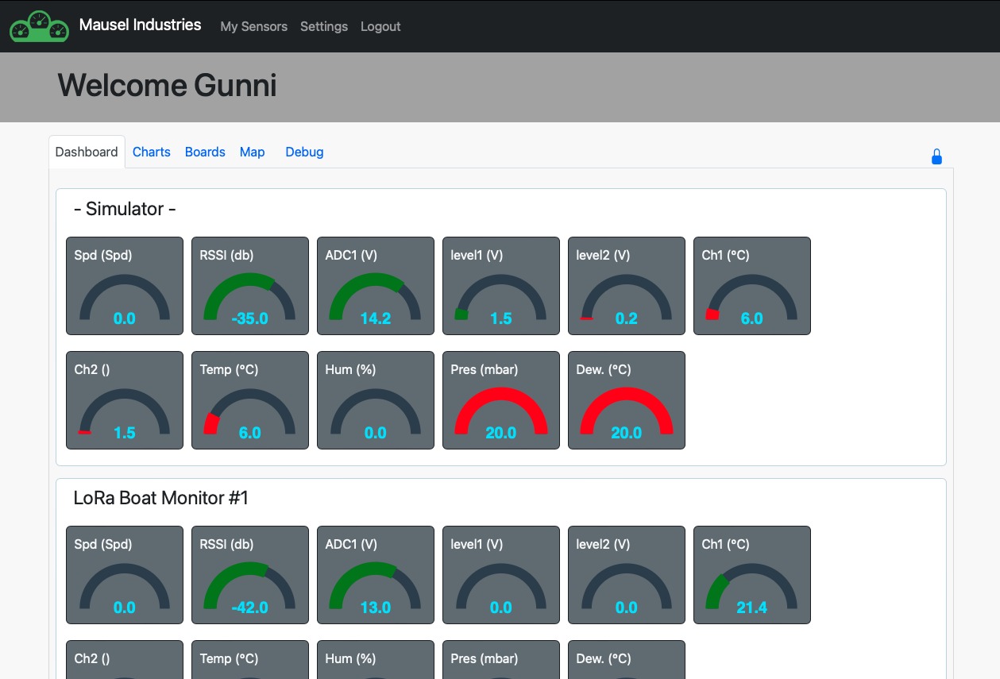
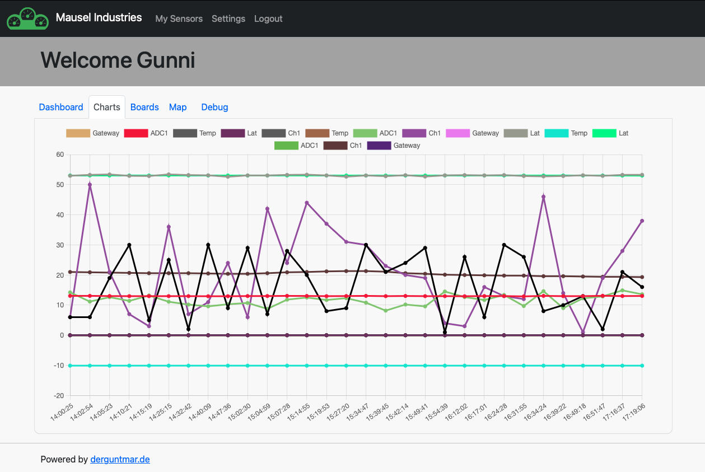
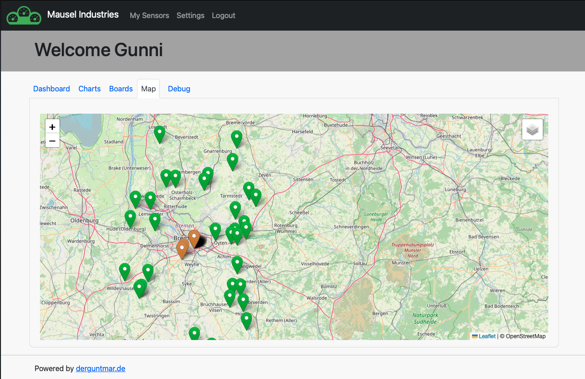

# Intro
**Maritime Data Server** is the central data (cloud) server for Maritime Data. 
It stores the Data that come from, for exmaple **MDC** (Maritime Data Collector or LoRa-Bootsmonitor or any other device), into a database and gives the user a GUI to show the data and do some configurations.

The initial idea was, to have the possibility to be able to see some Maritime Data (temperature, battery voltages, bilge alarm) while you are not on the boat.  

The **MDC** it a small board with an ESP32 and a few sensors, that collects the sensor data and transfer these data to the MDS.
You will find the **MDC** documentation under **https://github.com/bytecrusher/MaritimeDataCollectorSmall**

## **MDS** (Maritime Data Server)

The **Maritime Data Server** is a web application to store data and display data for the user.
It requres a mySQL Database for storing the data and a webserver with php support to display the informations with data.
The **MDS** can display the data from sensors in graph/gauges or charts.
Also it is possible to configure your boards and sensors.

## Description
The server is organized in a Backend (API for receiving data from collector and ttn, send emails) and a Frontend for displaying data in the users Browser.  
The Backend stores the data into the DB. It also checks if data are valid and board and sensors are existing in the DB, otherwise new DB records will be create.  
For the Frontend the user needs to login. Now the user is able to do some configurations or display some data.

#### Functions / ToDos Status / Bugs
- [x] MDS with Web interface
- [x] Alert via email an Telegram (need more configuration)
- [x] Chart view of data
- [x] configure boards and sensors in web interface
- [x] change client communication to JSON.
- [x] get data from TTN
- [ ] Change static email addresses (sender) into variables. These will be defined in the install script.

## Folder description

- **docu_donotdeploy** folder contains data and Images for documentation.
- **src**
     - **frontend** the frontend files for this web project
          - **api** api files for requests from JS.
          - **common** common files like "header" and "footer".
          - **css** stylesheets
          - **func** php functions for internal use (DB connection, users, boards...).
          - **img** images for pages, i.e. board images.
          - **js** javascript files.
          - **register** Files for new user registering.
     - **install** scripts to install and prepare sql DB, create the tables and the admin user.
     - **logs** log files for debugging.
     - **node_modules** (maybe not exist right now, because it will be created after running npm)
     - **otafirmware** contains OTA files for update ESP.
     - **receiver** functions for receiving data from MDCs.

#### Installation
Copy all **MDS** files from the "src" folder into your htdocs dir.
Create a new Database (with phpmyadmin) and create a new User with write privileges to this database.
Open **http://yourdomain/maritimedataserver/install/index.php** in your Browser and step through the instalation steps.
After install is finished, remove the dir named "install" (for security reasons).

Now the **MDS** is available under **http://yourdomain/maritimedataserver**

#### MDS Requirements
For running the **MDS** you need a (Apache) Webserver with PHP support and a MySQL DB.  
If you run **MDC**s outside our local network, your **MDS** needs to be public (TTN should be able to reach this server).

###### Development
For development i use different solutions.
First is local Docker container that runs on my coding computer.
Second i have on my webhosting a subdomain, that pulls my "developtment" branch from guthub there.

######## My current way
First wave:
I setup 4 containers (one for each service):
- Apache
- PHP
- PHPmyAdmin
- MySQL

I configured my VSC to be able work direct in the htdocs folder if apache.
So there is no manual synch of files needed.

Second wave:
in my webhosting subdomain, i setup my respository, so i am able to run a pull request from the plesk panel and have tha latest development branch on the webspace.

###### Debugging with xDebug
for php debugging i use xdebug.
The configuration in MAMP is done in **/Applications/XAMPP/xamppfiles/etc/php.ini and looks:  
[xdebug]  
zend_extension="/usr/local/Cellar/php/8.1.1/pecl/20210902/xdebug.so"  
xdebug.mode=debug  
xdebug.client_host=127.0.0.1  
xdebug.client_port="9000"  

In Firefox i use the "Xdebug helper" (IDE Key: VSCODE).  
In Safari i use "XDebugToggleExtension 1.2".

For Debug you have to go to "Ausführen" - "Debugger starte" and the green play button (F5).

## Sensor Schemas
Due different types of sensors and try to reduce the amount of data transferred via wifi (and later lora) it is a good idea to have a schema for sensors to transfer the data.
Also there is no need to deliver the name of the value.  
If all values deliver in the correct order, it is clear which value is wich.

Schema #: 1  
Name: DS18b20  
Deschription: Tempsensor  
Nr of sensor (that are connected): 1  
Count of Values: 1  
Name of Values: #1 Temperature  
Type of value: #1 uint8 (?)  

Schema #: 2  
Name: DS2438  
Deschription: Batteriemonitor  
Nr of sensor (that are connected): 1  
Count of Values: 4  
Name of Values: #1 CH1 Voltage, 2# CH1 Current, #3 CH2 voltage, #4 CH2 current  
Type of value: #1 uint8 (?), #2 uint8 (?), #3 uint8 (?), #4 uint8 (?)  

Schema #: 3  
Name: DHT11  
Deschription: Tempsensor & Humidity  
Nr of sensor (that are connected): 1  
Count of Values: 2  
Name of Values: #1 Temperature, #2 Humidity  
Type of value: #1 uint8 (?), #2 uint8 (?)  

Schema #: 4  
Name: Digital Input  
Deschription: Digital Input  
Nr of sensor (that are connected): 1  
Count of Values: 1  
Name of Values: #1 Digital input  
Type of value: #1 Bool (?)  

Schema #: 5  
Name: GPS  
Deschription: Data from GPS Receiver  
Nr of sensor (that are connected): 1  
Count of Values: 4  
Name of Values: #1 Latitude, #2 Longitude, #3 Course, #4 Speed  
Type of value: #1 uint8 (?), #2 uint8 (?), #3 uint8 (?), #4 uint8 (?)  
