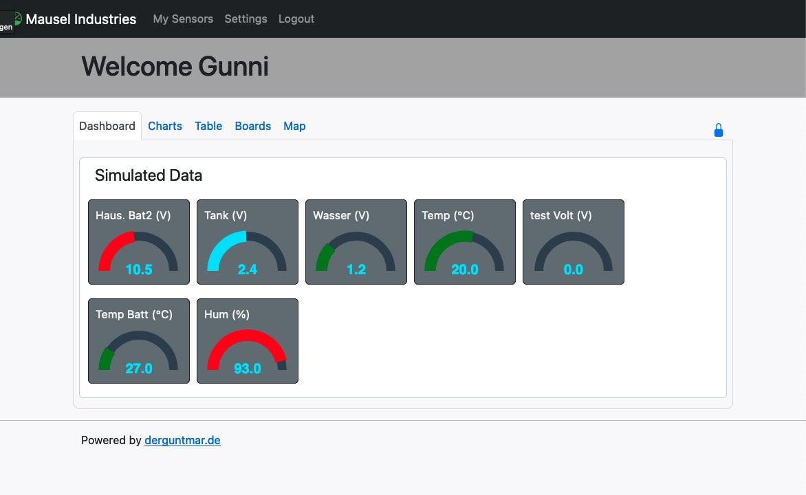
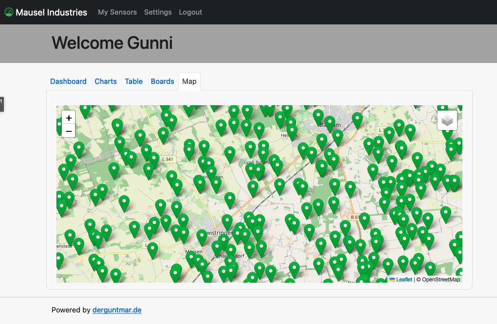

# Intro
**Maritime Data Server** is the central data server for Maritime Data. 
It stores the data that come from **MDC** (Maritime Data Collector) (for example LoRa-Bootsmonitor or any other device) in a database and gives the user a GUI to show the data and do some configurations.

The initial idea was, to have a possibility to be able to see some Maritime data (temperature, battery voltages) while you are not on the boat.  

The **MDC** it a small board with an ESP32 and a few sensors, that collects the sensor data and transfer it to the server.
You will find the **MDC** documentation under **https://github.com/bytecrusher/MaritimeDataCollectorSmall**

## **MDS** (Maritime Data Server)

The **Maritime Data Server** is a application to store data and display data for the user.
It requres a SQL Database for storing the data and a webserver to display the pages with data.
With **MDS** you can view data from sensor in graph or charts.
Also it is possible to configure your boards and sensors.

## Description
The server is organized in a Backend (API for receiving data from collector) and a Frontend for displaying data in a Browser for the user.  
The Backend stores the data in a DB. It also checks if data are valid and board and sensors are existing in the DB, otherwise new DB records will be create.  
For the Frontend the user needs to login. Now the user is able to do some configurations or show some data.

#### Functions / ToDos Status / Bugs
- [x] MDS with Web interface
- [x] Alert via email an Telegram (need more configuration)
- [x] Chart view of data
- [x] configure boards and sensors in web interface
- [x] change client communication to JSON.
- [x] get data from TTN
- [ ] Change static email addresses (sender) into variables. These will be defined in the install script.

## Folder description

- **backend** files for comunicate with collector and sending mail or telegram messages.
- **cgi-bin** script for trigger php files to run, to check for sending any message to users (mail).
- **docu_donotdeploy** folder contains data for documentation.
     - **images** Images for documentation.
- **frontend** the frontend for this webproject
     - **api** api files for request from JS.
     - **common** common files like "header" and "footer".
     - **css** stylesheets
     - **fonts** fonts
     - **func** php functions for internal use (DB connection, user, boards...).
     - **img** images for pages, i.e. board images.
     - **js** javascript files.
     - **logs** log files for debugging.
     - **webfonts**
- **logs** log files for debugging.
- **otafirmware** contains OTA files for update ESP.
- **receiver** functions for receiving data from MDCs.
- **install** scripts to install and prepare sql DB, create the tables and the admin user.

#### Installation
Copy all **MDS** files to your htdocs dir.
Create a new Database (with phpmyadmin) and a new User with write privileges to this database.
Open **http://yourdomain/maritimedataserver/install/index.php** in your Browser and step through the steps.
After install is finished, remove the dir named "install".

Now the **MDS** is available under **http://yourdomain/maritimedataserver**

#### MDS Requirements
For running the **MDS** you need a Apache Webserver with php support and a MySQL DB.  
If you run **MDC**s outside our local network, your **MDS** needs to be public.

###### Development
For development i use a Bitnami image for XAMPP Stack 8.1.1-2 under MacOS.  
In **Applications/XAMPP/xamppfiles/htdocs** i put the project from git.

Now the page is available at **http://yourdomain/maritimedataserver**

###### Debugging with xDebug
for php debugging i use xdebug.
The configuration in MAMP is done in **/Applications/XAMPP/xamppfiles/etc/php.ini and looks:  
[xdebug]  
zend_extension="/usr/local/Cellar/php/8.1.1/pecl/20210902/xdebug.so"  
xdebug.mode=debug  
xdebug.client_host=127.0.0.1  
xdebug.client_port="9000"  

In Firefox i use the "Xdebug helper" (IDE Key: VSCODE).  
In Safari i use "XDebugToggleExtension 1.2".

For Debug you have to go to "Ausführen" - "Debugger starte" and the green play button (F5).

## Sensor Schemas
Due different types of sensors and try to reduce the amount of data transferred via wifi (and later lora) it is a good idea to have a schema for sensors to transfer the data.
Also there is no need to deliver the name of the value.  
If all values deliver in the correct order, it is clear which value is wich.

Schema #: 1  
Name: DS18b20  
Deschription: Tempsensor  
Nr of sensor (that are connected): 1  
Count of Values: 1  
Name of Values: #1 Temperature  
Type of value: #1 uint8 (?)  

Schema #: 2  
Name: DS2438  
Deschription: Batteriemonitor  
Nr of sensor (that are connected): 1  
Count of Values: 4  
Name of Values: #1 CH1 Voltage, 2# CH1 Current, #3 CH2 voltage, #4 CH2 current  
Type of value: #1 uint8 (?), #2 uint8 (?), #3 uint8 (?), #4 uint8 (?)  

Schema #: 3  
Name: DHT11  
Deschription: Tempsensor & Humidity  
Nr of sensor (that are connected): 1  
Count of Values: 2  
Name of Values: #1 Temperature, #2 Humidity  
Type of value: #1 uint8 (?), #2 uint8 (?)  

Schema #: 4  
Name: Digital Input  
Deschription: Digital Input  
Nr of sensor (that are connected): 1  
Count of Values: 1  
Name of Values: #1 Digital input  
Type of value: #1 Bool (?)  

Schema #: 5  
Name: GPS  
Deschription: Data from GPS Receiver  
Nr of sensor (that are connected): 1  
Count of Values: 4  
Name of Values: #1 Latitude, #2 Longitude, #3 Course, #4 Speed  
Type of value: #1 uint8 (?), #2 uint8 (?), #3 uint8 (?), #4 uint8 (?)  
